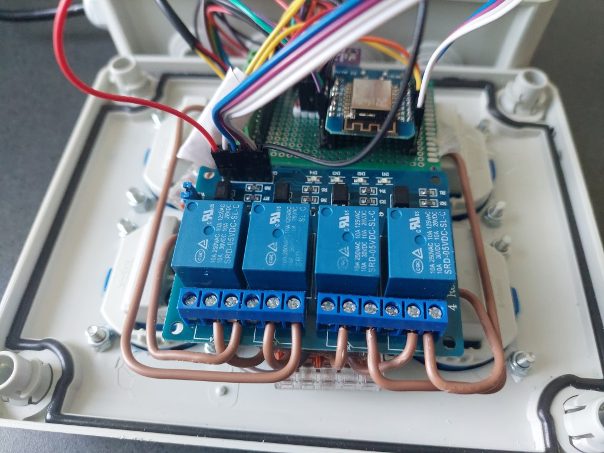

# Aquarium

Control of aquarium technology and sensors

## FEATURES

- Connects to the Wireless Access Point / Wifi Router
- Securely connects to the MQTT Broker (TLS)
- Subscribes to the desired MQTT topics
- Handles incoming MQTT messages
- Controls ESP8266 Chip Level Data Pins
- Sends a heartbeat signal to the MQTT broker periodically
- Switches a quattro relay (230V) for daylight, nightlight, airpump and filter
- Monitoring of room temperature, humidity and air pressure with GY-BME280 sensor
- Monitoring water temperature DS18B20 Temperature sensor (5 V with 4.7 kΩ pullup required - internal pullup not sufficient)

<!-- TOC -->

- [Aquarium](#aquarium)
    - [FEATURES](#features)
    - [REQUIREMENTS](#requirements)
        - [HARDWARE](#hardware)
        - [PROPOSAL FOR A HOUSING](#proposal-for-a-housing)
        - [LIBRARIES](#libraries)
    - [INSTALL AND USAGE](#install-and-usage)
        - [PINOUT](#pinout)
        - [MQTT TOPICS](#mqtt-topics)
    - [LICENSE](#license)

<!-- /TOC -->

## REQUIREMENTS

### HARDWARE

- Wemos D1 Mini (should work with other Arduino microcontrollers too)
- PlatformIO or Arduino IDE (for Arduino IDE you have to move files from /src to root-folder)
- MQTT Broker such as the Mosquitto MQTT Broker (https://mosquitto.org/)
- ControllApp such as MQTT Dash (https://play.google.com/store/apps/details?id=net.routix.mqttdash&hl=en)
- 2-Relais Module 5V with Optokoppler low-level trigger compatible with Arduino
- GY-BME280 sensor
- DS18B20 Temperature sensor

### PROPOSAL FOR A HOUSING 

- OBO Junction box surface 190 mm x 150 mm Grey IP66 (https://www.obi.de/abzweigkasten/obo-abzweigkasten-aufputz-190-mm-x-150-mm-grau-ip66/p/1801471)
- Surface-mounted socket with hinged cover 2-pole 16 A Blue (https://www.obi.de/schutzkontaktkupplungen/anbausteckdose-mit-klappdeckel-2-polig-16-a-blau/p/2425817)
- Threaded screw M4x16 with countersunk head (https://www.obi.de/feinsicherungen/kabelverschraubung-m20-grau-5-stueck/p/3214905)
- Lock nut M4
- Cable gland M20 Grey 5 pieces
- WAGO 221-415 5x AWG 24-12 Cu

These are only sample links because we get a discount at OBI. Feel free to shop at the retailer you trust.

Below are a few examples of the case for the project as a suggestion.

</img> </img> </img> </img> </img>  

### LIBRARIES

- PubSubClient by Nick O'Leary
- esp8266_mdns by dunk
- DallasTemperature by Miles Burton

## INSTALL AND USAGE

### PINOUT

| Sensor-Description | Sensor-PIN | Arduino-PIN | GPIO | CABLE-COLOR |
| --- | --- | --- | --- | --- |
| BUILTIN_LED | - | D4 | GPIO 2 | - |
| DO NOT USE IF NOT NECASSARY | - | D3 | GPIO 0 | - |
| SRD-05VDC-SL-C Relais	| GND | GND | - | 
| SRD-05VDC-SL-C Relais	| IN1 | D5 | GPIO 14 | GREY |
| SRD-05VDC-SL-C Relais	| IN2 | D6 | GPIO 12 | VIOLET |
| SRD-05VDC-SL-C Relais	| IN3 | D3 | GPIO 0 | BLUE |
| SRD-05VDC-SL-C Relais	| IN4 | D0 | GPIO 16 | WHITE |
| SRD-05VDC-SL-C Relais	| VCC | 5.0 V |	- | - |
| SRD-05VDC-SL-C Relais	| NC1 + COM1 | Phase L (230V) Nightlight | - | - |
| SRD-05VDC-SL-C Relais	| NC2 + COM2 | Phase L (230V) Daylight | - | - |
| SRD-05VDC-SL-C Relais	| NC1 + COM1 | Phase L (230V) Airpump | - | - |
| SRD-05VDC-SL-C Relais	| NC2 + COM2 | Phase L (230V) Filter | - | - |
| GY-BME280 Barometric sensor | VCC | 3V | - | - |
| GY-BME280 Barometric sensor | GND | GND | - | - |
| GY-BME280 Barometric sensor | SDA | D2 | GPIO 4 | GREEN |
| GY-BME280 Barometric sensor | SCL | D1 | GPIO 5 | VIOLET |
| DS18B20 waterproof temperature sensor | RED | 5.0V | - | RED |
| DS18B20 waterproof temperature sensor | BLACK | GND | - | BLACK |
| DS18B20 waterproof temperature sensor | YELLOW | D7 | GPIO 13 | YELLOW |

* Unlike in my other projects I decided to connect the voltage to the NC pins (normal close) of the double relay. The reason is that in case of an Arduino failure the light should be switched on completely instead of off during a longer vacation.
* Actually you should not necessarily use GPIO 0, but for some reason the Arduino did not boot when port D8 was used for the relay.

### MQTT TOPICS

| MQTT Topic | Description | Possible values |
| --- | --- | --- |
| home/outdoor/aquarium/daylight | Switches the daylight on or off | on, off |
| home/outdoor/aquarium/nightlight | Switches the nightlight on or off | on, off |
| home/outdoor/aquarium/airpump | Switches the airpump on or off | on, off |
| home/outdoor/aquarium/filter | Switches the filter on or off | on, off |
| home/outdoor/aquarium/nightlight | Switches the nightlight on or off | on, off |
| home/outdoor/aquarium/temperature | Room temperature | {value} |
| home/outdoor/aquarium/humidity | Room humidity | {value} |
| home/outdoor/aquarium/pressure | Room pressure | {value} |
| home/outdoor/aquarium/watertemperature | Aquarium water temperature | {value} |
| home/outdoor/aquarium/heartbeat | Heartbeat for troubleshooting | on |

* I do not use the Arduino for switching the filter. Since this runs 365 days a year 24h a week and is only switched off during the weekly water change and cleaning, it hangs directly on the power. In the code I have provided it only as a placeholder of the quattro relay.

## LICENSE

Aquarium and all individual scripts are under the BSD 3-Clause license unless explicitly noted otherwise. Please refer to the LICENSE